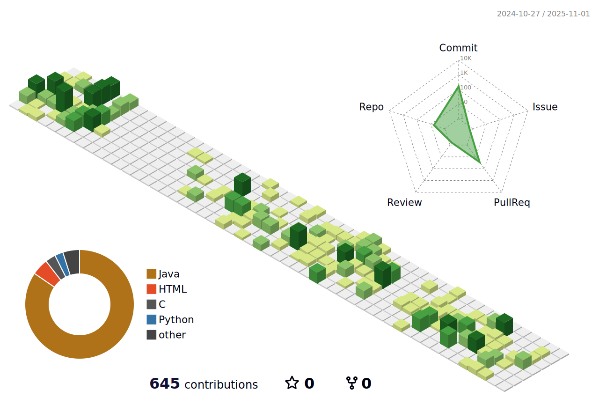

<!-- Header Bilingual -->

  <h1>🌨️🌧️❄️ Victor ❄️🌧️🌨️</h1>
  
🎧🌧️❄️🏔️🌲~ Victor❤️Glória

  <h4>🇺🇸 Tech. IT | Systems Analysis and Dev   🇧🇷 Tec. Informática | Análise e Desenvolvimento de Sistemas </h4>
  
  
  

  

   

---

   
    <h3><b>📊 🇺🇸 Summary Cards | 🇧🇷 Cartões de Resumo </b></h3>
  
  
  
  
   

---

  <h3><b>🇺🇸 About Me | 🇧🇷 Sobre Mim </b></h3>
  
  

 

#### 🎓 🇺🇸 Education | 🇧🇷 Formação Acadêmica

- **🦠UFPR** (Brasil/Brazil) 
  🇺🇸 `🗺️🛰️ Technologist in Systems Analysis & Development` 
  🇧🇷 `Análise e Desenvolvimento de Sistemas`

*🇺🇸 `📠Computer Technician` (IT integrated with HS at PUCPR)* 
*🇧🇷 `Técnico em Informática integrado ao Ensino Médio (PUCPR)*
